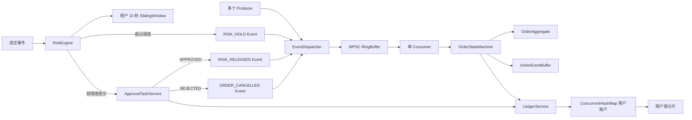
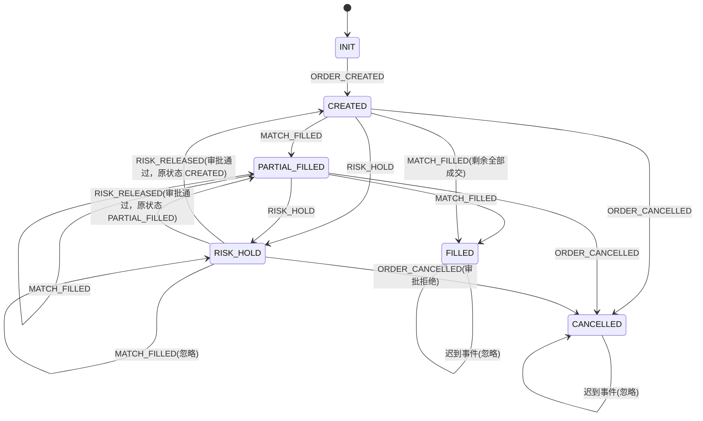
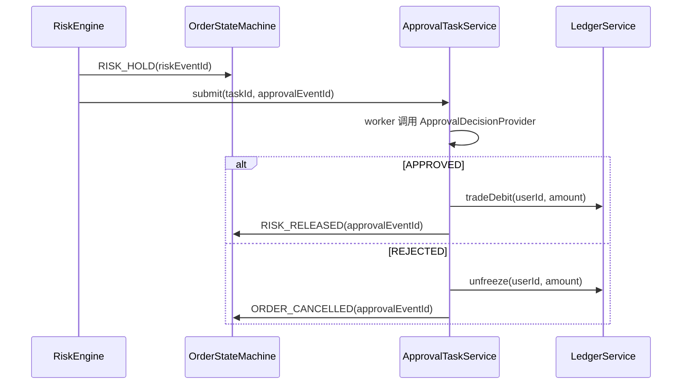
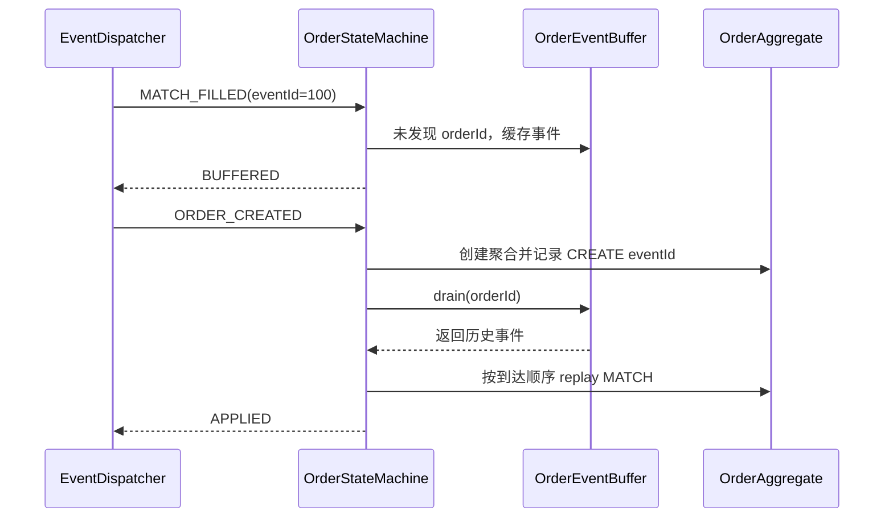

# cex-core-engine

一个只依赖 JDK 运行时的纯 Java 内存交易核心模块，模拟 CEX 内部 Core Ledger、订单状态机、事件引擎和内存风控的关键机制。

## 1. 设计目标

- 运行时只使用 JDK 原生类库；JUnit 5 仅作为测试依赖。
- 资金、价格、数量和成交量统一使用 `long`，单位由交易产品定义为资产最小单位。
- 支持多生产者、单消费者事件流水线。
- 支持订单事件乱序到达和基于 `eventId` 的幂等处理。
- 支持同一用户资产账户的并发冻结、解冻和成交结算。
- 默认使用 10 秒成交金额滑动窗口进行内存风控。
- 通过 primitive RingBuffer、primitive 去重集合和固定容量延迟采样降低 GC 压力，适配 `-Xmx256m`。

## 2. 项目结构

```text
src/main/java/com/cex/core/engine
├── account
│   └── Account.java                 # 轻量领域账户模型
├── event
│   ├── EventDispatcher.java         # 对象事件 MPSC -> 单消费者分发
│   ├── EventType.java               # 订单事件类型
│   ├── MpscRingBuffer.java          # JDK 原生对象事件环形队列
│   ├── OrderEvent.java              # 不可变订单事件
│   ├── PrimitiveEventDispatcher.java# primitive 优化事件分发
│   └── PrimitiveEventRingBuffer.java# 固定 primitive 槽位
├── ledger
│   ├── LedgerBalance.java           # 账本一致性快照
│   └── LedgerService.java           # 资金账本服务
├── order
│   ├── EventApplyResult.java        # 事件应用结果
│   ├── EventApplyStatus.java        # 事件应用状态
│   ├── Order.java                   # 不可变订单快照
│   ├── OrderEventBuffer.java        # 创建前滞后事件缓存
│   ├── OrderState.java              # 订单状态枚举
│   ├── OrderStateMachine.java       # 订单状态聚合和重放
│   └── PrimitiveLongSet.java        # primitive long 开放寻址集合
└── risk
    ├── ApprovalDecision.java        # 审批结果枚举
    ├── ApprovalDecisionProvider.java# 审批决策接口
    ├── ApprovalTask.java            # 纯内存审批任务
    ├── ApprovalTaskService.java     # 异步审批任务服务
    ├── ApprovalTaskStatus.java      # 审批任务状态
    ├── RiskDecision.java            # 风控判定结果
    ├── RiskEngine.java              # 用户成交金额风控
    ├── RiskState.java               # 风控状态
    └── SlidingWindow.java           # 时间窗口和过期回收
```

## 3. 系统架构图



系统有两条事件路径：

1. 兼容路径使用 `OrderEvent`、`MpscRingBuffer` 和 `apply`，便于调试和读取状态快照。
2. 高吞吐路径使用 `PrimitiveEventRingBuffer`、`PrimitiveEventDispatcher` 和 `applyFast`，事件字段直接写入固定 primitive 槽位，减少热路径对象创建。

风控计算与订单状态更新解耦。`RiskEngine` 负责累计成交金额和生成判定；超出阈值后生成独立的 `RISK_HOLD` 事件，并向 `ApprovalTaskService` 提交纯内存异步审批任务。审批通过时，审批 worker 调用账本 `tradeDebit` 扣减冻结资金并发布 `RISK_RELEASED` 放行事件；审批拒绝时调用 `unfreeze` 解冻资金并发布 `ORDER_CANCELLED` 撤单事件。审批任务以 `taskId` 幂等提交，重复审批请求不会重复扣减或重复解冻。

## 4. 订单状态机图



### 状态处理规则

- `ORDER_CREATED` 创建订单聚合，重复创建不会覆盖已经累计的成交事实。
- `MATCH_FILLED` 按剩余数量截断成交量，成交量达到订单数量后进入 `FILLED`，否则进入 `PARTIAL_FILLED`。
- `ORDER_CANCELLED` 只能影响未完成订单；`FILLED` 和 `CANCELLED` 是终态。
- `RISK_HOLD` 暂停订单后续成交，进入挂起时记录挂起前活跃状态，处于 `RISK_HOLD` 的订单不会继续累计成交量。
- `RISK_RELEASED` 只释放处于 `RISK_HOLD` 的订单，并恢复到挂起前的 `CREATED` 或 `PARTIAL_FILLED`。
- 审批拒绝复用 `ORDER_CANCELLED`，订单进入 `CANCELLED` 终态，同时由审批服务完成冻结资金解冻。
- 每个订单维护已处理 `eventId` 集合。重复事件只返回 `DUPLICATE` 或被忽略，不会重复累计成交。

## 5. 并发模型

### 5.1 事件流水线：MPSC + 单消费者

```text
Producer-1 ─┐
Producer-2 ─┼─ CAS 申请全局序号 ─> 固定 RingBuffer 槽位 ─> 单 Consumer
...       ─┘                                  │
                                             └─> OrderStateMachine
```

- 多个生产者通过 `AtomicLong.compareAndSet` 竞争唯一序号。
- 生产者写完槽位后发布 `publishedSequence`，消费者只读取已完整发布的事件。
- 消费者只有一个，因此同一消费序列无需消费者之间的锁竞争。
- RingBuffer 有界，满载时 `publish` 返回 `false`，阻塞版本通过自旋提供背压，并检查线程中断。
- 容量为 2 的幂，槽位定位使用位运算代替取模。

### 5.2 账本和状态机：锁分片

`LedgerService` 和 `OrderStateMachine` 均使用固定数量的非公平 `ReentrantLock` 分片：

```text
userId / orderId
       │
       v
hash -> stripeMask -> ReentrantLock[stripe]
```

- 同一用户的所有余额字段在同一分片锁内完成校验和更新。
- 同一订单的所有事件在同一分片锁内串行化。
- 不同用户或不同订单通常落入不同分片，可并行处理。
- `ConcurrentHashMap` 负责账户、订单聚合和用户风控窗口的并发索引。
- CAS 用于 RingBuffer 序号、混沌测试订单预留金额和无锁 primitive 集合；多字段资产转移没有强行使用 CAS，因为账本更新必须具备多字段原子性。

### 5.3 方案选择

| 方案 | 优点 | 局限 | 本项目用途 |
|---|---|---|---|
| `synchronized` | 语法简单 | 锁粒度和调度控制较弱 | 未选作核心账本方案 |
| `ReentrantLock` | 可配置非公平锁，适合显式临界区 | 存在分片碰撞 | 账本、状态机、风控窗口 |
| CAS | 无锁、适合单值更新 | 多余额字段难以组成一致快照，失败重试可能放大 CPU 消耗 | RingBuffer 序号、primitive 集合、测试预留额 |

### 5.4 风控审批工作流：RISK_HOLD + ApprovalTask

`ApprovalTaskService` 补齐了测评要求中的异步审批链路，整体仍然只依赖 JDK 原生并发工具：



- `submit` 使用 `ConcurrentHashMap.putIfAbsent(taskId)` 做任务幂等，重复审批任务不会重复进入队列。
- worker 使用单线程 `LinkedBlockingQueue` 异步消费审批任务，避免审批流程进入高频撮合事件热路径。
- 审批通过时，账本先从冻结金额扣减到 `traded`，再发布 `RISK_RELEASED`，订单恢复到进入 `RISK_HOLD` 前的活跃态。
- 审批拒绝时，账本先解冻资金，再发布 `ORDER_CANCELLED`，订单进入终态 `CANCELLED`。
- 审批策略返回空结果、冻结余额不足或解冻失败时，任务进入 `FAILED`，订单保持 `RISK_HOLD`，避免状态和资金侧产生半完成语义。

## 6. 资产一致性证明

每个账户开户时建立不可变守恒常量：

```text
constant = initialAvailable
available = initialAvailable
frozen = 0
traded = 0
```

系统维护以下不变量：

```text
available + frozen + traded = constant
```

所有资金字段使用资产最小单位的 `long`。每次操作都在用户分片锁内完成，其他线程不会观察到该次操作的中间状态。

| 操作 | 余额变化 | 守恒变化 |
|---|---|---|
| `freeze(amount)` | `available -= amount`；`frozen += amount` | `-amount + amount = 0` |
| `unfreeze(amount)` | `frozen -= amount`；`available += amount` | `-amount + amount = 0` |
| `tradeDebit(amount)` | `frozen -= amount`；`traded += amount` | `-amount + amount = 0` |
| `tradeCredit(amount)` | `available += amount`；`traded -= amount` | `+amount - amount = 0` |

因此，设一次操作前余额为 `(A, F, T)`，操作后为 `(A', F', T')`，四类资金操作均满足：

```text
A' + F' + T' = A + F + T = constant
```

账本只允许从有足够余额的桶中扣减：冻结要求 `available >= amount`，解冻和成交借记分别要求 `frozen >= amount`。金额非正数直接拒绝，溢出通过 `Math.addExact`/`Math.subtractExact` 暴露，避免静默破坏守恒计算。

`traded` 是成交结算偏移桶，允许为有符号值，用于在内存模型中表示成交借记和成交贷记的相对结算变化；最终守恒检查仍以三项代数和为准。

## 7. 乱序事件收敛方案



收敛规则：

1. 已知订单：事件直接在对应 `orderId` 锁分片内处理。
2. 未知订单的非创建事件：转换为不可变 `OrderEvent` 写入 `OrderEventBuffer`，不丢弃业务事实。
3. `ORDER_CREATED` 到达：先创建聚合，再 `drain(orderId)`，按缓存顺序补偿历史事件。
4. 缓存阶段使用 `putIfAbsent(eventId)` 防止同一个滞后事件重复进入队列。
5. 重放阶段和正常阶段使用同一套 `applyKnownEvent`，先写入 primitive 幂等集合，再执行状态分支。
6. 同一个 `MATCH_FILLED(eventId=100)` 重复投递 10 次，最多一次改变 `filledQuantity`。
7. 终态订单对迟到事件不产生业务变化，但仍保留事件幂等记录，避免再次进入处理路径。

该方案的收敛前提是：同一订单的业务事件最终会到达，且同一个 `eventId` 表示同一业务事实。事件缓存是内存结构，不提供进程崩溃后的持久化恢复能力。

## 8. 内存优化方案

### 8.1 对象和数据结构

- 订单和账户领域对象仅保留核心字段，金额、价格、数量、ID 使用 primitive `long`。
- `OrderStateMachine` 内部使用可变 primitive 聚合；只有兼容 `apply` 或查询快照时才创建 `Order`/`EventApplyResult`。
- `PrimitiveLongSet` 使用 `long[] + boolean[]` 开放寻址，避免 `HashSet<Long>` 的装箱对象和节点对象。
- `PrimitiveEventRingBuffer` 以固定数组保存事件类型、交易对引用和 7 个 primitive payload 字段，槽位循环复用。
- 消费完事件后清空交易对引用，避免 RingBuffer 长期持有字符串对象。
- 混沌测试使用固定容量 `AtomicLongArray` 循环覆盖延迟样本，避免 60 秒运行期间无限增长。

### 8.2 GC、锁和 CPU Cache

| 优化点 | 实现 | 目标 |
|---|---|---|
| 对象创建 | primitive 事件路径、内部可变聚合 | 降低每事件对象数 |
| 装箱开销 | primitive `long` 集合和数组 | 减少 `Long` 对象及 GC |
| 内存占用 | 有界 RingBuffer、固定延迟样本 | 适配 `-Xmx256m`，避免 OOM |
| 锁竞争 | 用户/订单锁分片 | 避免全局锁，允许不同键并行 |
| CAS 竞争 | 仅用于序号和单值预留 | 保持生产者入队和测试扣减高吞吐 |
| CPU Cache | 连续 primitive payload 数组、固定槽位 | 改善生产者/消费者局部性 |

对象复用并不改变业务语义：RingBuffer 槽位在消费者完成读取后才由生产者重新使用；状态机的幂等集合仍保留业务事件 ID。

## 9. Benchmark 结果

测试类：`EventPipelineBenchmarkTest`。

测试条件：

- JDK 原生实现
- 16 个生产者、1 个消费者
- 每次 500,000 个事件
- 5 次正式测量取中位数
- JVM 最大堆：`-Xmx256m`

最近一次运行结果：

```text
Event pipeline benchmark (500000 events, 16 producers / 1 consumer)
Before: TPS=2286582.93, avg/event=0.44 us, GC collections=0, GC time=0 ms
After : TPS=2481144.54, avg/event=0.40 us, GC collections=0, GC time=0 ms
Speedup: 1.09x, GC collections delta: 0 -> 0
```

其中：

- Before：`OrderEvent` + 对象 `MpscRingBuffer` + `apply`。
- After：primitive `PrimitiveEventRingBuffer` + `PrimitiveEventDispatcher` + `applyFast`。
- 该结果用于比较当前代码路径的相对收益，实际吞吐会受 CPU、JIT、线程调度和运行环境影响。

运行命令：

```powershell
$env:MAVEN_OPTS='-Xmx256m'
mvn -q -Dgroups=benchmark test
Remove-Item Env:MAVEN_OPTS
```

## 10. Chaos 测试结果

测试类：`ChaosConcurrencyTest`。

测试条件：

- 16 个工作线程
- 持续 60 秒
- 随机执行 `submitOrder()`、`cancelOrder()`、`match()`
- 随机 `Thread.sleep()`
- 协调线程随机调用 `Thread.interrupt()`
- 故意执行零金额资金操作，验证异常路径
- 测试结束校验每个用户的资产守恒

最近一次运行结果：

```text
Chaos metrics: operations=21686993, TPS=361390.20, avgLatency=0.15 us,
P99=0.70 us, expectedExceptions=216545, interrupts=5887
```

最终断言：

```text
available + frozen + traded = initialBalance
```

因此混沌测试不是只验证成功案例，同时覆盖线程中断、非法金额、账户竞争、重复订单操作、事件背压和成交/撤单竞争。

运行命令：

```powershell
$env:MAVEN_OPTS='-Xmx256m'
mvn -q -Dgroups=chaos test
Remove-Item Env:MAVEN_OPTS
```

## 11. 构建和完整验证

```powershell
$env:MAVEN_OPTS='-Xmx256m'
mvn -q test
Remove-Item Env:MAVEN_OPTS
```

完整测试覆盖领域模型、账本并发、订单乱序与幂等、事件分发、风险窗口、ApprovalTask 审批闭环、Benchmark 和 Chaos 流程。

## 12. 使用边界

- 当前账本、审批任务和事件队列完全驻留内存，不提供 WAL、快照或进程崩溃恢复。
- 当前实现是结算核心模块，不包含撮合算法、网络协议、认证授权和持久化存储。
- `long` 金额必须由上层统一定义精度和溢出边界，禁止混用不同资产精度。
- `publish` 返回 `false` 时，调用方必须实施重试、降速或上游背压策略。
- 事件幂等依赖业务方提供稳定且唯一的 `eventId`；不同业务事实不得复用同一 ID。
