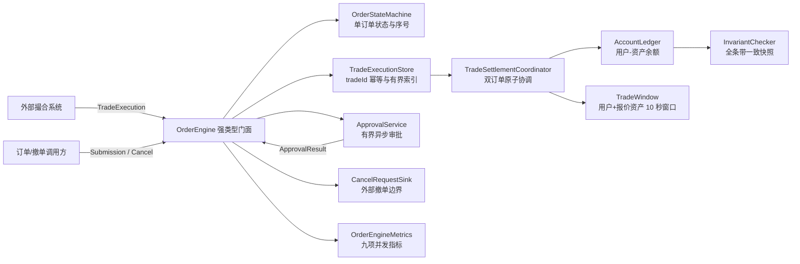

# CEX Core Engine

纯 Java 21 / JUC 的内存交易核心测评工程。系统消费外部撮合服务给出的权威双边成交，支持部分成交、对手方原子结算、每订单单调序号、权威撤单确认与异步风控审批，并在 `-Xmx256m` 下验证逐资产守恒、非负余额、吞吐、延迟、GC、死锁和线程终止。

本工程是进程内结算核心样例，不是完整交易所。金额、数量和时间都使用 primitive `long`；资产数量由上游按最小单位传入，结算层不做价格乘法、精度换算或舍入。

## 能力与边界

### 已实现

- BUY 冻结报价资产，SELL 冻结基础资产。
- 一笔 `TradeExecution` 同时更新买卖双方订单和四个资产桶，不允许单边成交。
- 一个订单可被多笔不同 `tradeId` 部分成交，最终进入 `FILLED` 或经确认进入 `CANCELED`。
- 创建、成交、撤单确认可乱序和重复到达；每个订单使用独立 `orderSequence`。
- `tradeId` 对成交做进程内幂等；相同标识不同载荷被判为协议冲突。
- `RISK_HOLD` 保留冻结资金，审批通过后排空成交，审批拒绝后发送稳定撤单请求并等待权威确认。
- 账本按资产分别守恒，所有 `available` 和 `frozen` 余额始终不得为负。
- 固定条带锁顺序、有界缓存、primitive 风控窗口和固定桶延迟统计适配 256 MB 堆。

### 明确非目标

- 不实现订单簿、价格优先、时间优先或撮合算法。
- 不计算成交价格，不处理精度换算、舍入、Maker/Taker 手续费或折扣。
- 不支持自成交；买卖双方必须是不同用户。
- 不实现数据库、WAL、消息中间件、进程重启恢复或跨服务事务。
- 不实现网络协议、鉴权、限流或持久化幂等键。
- Benchmark 只测量进程内状态与结算路径，不代表包含网络、序列化、撮合和存储后的生产容量。

## 强类型入口

`OrderEngine` 只接受含义明确的不可变输入：

```java
OrderContext submit(OrderSubmission submission);
TradeResult onTrade(TradeExecution execution);
CancelRequestResult requestCancel(CancelRequest request);
void onCancelConfirmed(CancelConfirmation confirmation);
void onApproval(ApprovalResult result);
OrderContext order(long orderId);
TradeExecutionRecord trade(long tradeId);
```

输入职责如下：

| 输入 | 业务含义 |
|---|---|
| `OrderSubmission` | 用户、方向、交易对、基础数量、冻结数量、报价资产风控金额、创建序号和时间 |
| `TradeExecution` | 外部撮合产生的 `tradeId`、买卖订单、基础/报价成交数量、双方订单序号和时间 |
| `CancelRequest` | 本地幂等撤单意图；首次本地登记即进入 `PENDING_CANCEL`，sink 失败仍保持该状态并复用同一 `cancelRequestId` 重试，确认前资金继续冻结 |
| `CancelConfirmation` | 外部撮合确认的撤单结果及订单权威序号 |
| `ApprovalResult` | 异步风控审批的 PASS 或 REJECT 回流 |

`TradeExecution.baseQuantity` 和 `quoteQuantity` 是外部撮合结果的权威最小单位整数。结算器只验证并搬移资产，不重算两者关系。

## 架构



### 组件职责

| 组件 | 负责 | 不负责 |
|---|---|---|
| `OrderEngine` | 冻结后发布订单、分发强类型输入、排空序号、审批与撤单编排 | 撮合、持久化、网络重试策略 |
| `OrderStateMachine` | 单订单累计成交、剩余数量、序号和状态的两阶段变更 | 修改账户余额、协调对手订单 |
| `TradeSettlementCoordinator` | 校验双方下一序号，以固定锁顺序准备并提交双边成交 | 计算价格、舍入或手续费 |
| `TradeExecutionStore` | `tradeId` 登记、终态幂等、待成交订单索引和容量背压 | 驱逐未完成权威成交 |
| `AccountLedger` | 用户—资产余额、冻结/解冻、双边交割和逐资产不变量 | 决定订单业务状态 |
| `RiskPipeline` / `ApprovalService` | 创建风控、有界异步审批与结果回流 | 在审批线程直接修改资金 |
| `TradeWindow` | `(userId, quoteAsset)` 隔离的 10 秒 primitive 滑动窗口 | 合并不同报价资产金额 |

## 订单状态机

```text
INIT -> NEW / RISK_HOLD
NEW -> PARTIALLY_FILLED -> FILLED
NEW / PARTIALLY_FILLED / RISK_HOLD -> PENDING_CANCEL
PENDING_CANCEL -> PENDING_CANCEL / FILLED / CANCELED
```

| 状态 | 含义 | 资产规则 |
|---|---|---|
| `INIT` | 上下文尚未完成强类型创建 | 不发生冻结或结算 |
| `NEW` | 创建风控通过且预留已冻结 | 等待权威成交或撤单 |
| `RISK_HOLD` | 创建需要异步审批 | 资金继续冻结，成交只缓存 |
| `PARTIALLY_FILLED` | 至少结算一笔且仍有剩余基础数量 | 未成交部分继续冻结 |
| `PENDING_CANCEL` | 撤单已请求，等待外部确认 | 仍可结算确认序号之前的成交 |
| `FILLED` | 基础数量全部成交 | 订单剩余冻结额为零 |
| `CANCELED` | 权威确认已消费并释放余量 | 累计成交保留，剩余冻结额为零 |

部分成交不会覆盖累计值。每笔成交更新 `cumulativeBaseFilled`、`cumulativeQuoteFilled`、`remainingBaseQuantity` 和 `remainingReservedAmount`。如果 BUY 全成后因价格改善仍有未使用报价预留，该余款与最后一笔成交在同一账本 mutation 内释放，避免第二次独立写入。

## 双序号、乱序与幂等

每个订单独立维护：

```text
lastAppliedSequence
nextExpectedSequence = lastAppliedSequence + 1
pendingEvents: sequence -> event
```

- 等于下一序号：尝试执行。
- 高于下一序号：有界缓存并记录序号空洞。
- 低于下一序号：按过期或重复处理。
- 同一订单、同一序号、不同载荷：拒绝为协议冲突。
- 一笔成交只有同时位于买卖双方下一合法序号时才可提交。
- 交叉空洞不得推进任一单边；后续连续事件暴露后继续从双方头部排空。

`TradeExecutionStore` 的记录状态为 `PENDING`、`SETTLED`、`REJECTED`：

- 首次 `tradeId` 保留完整原始载荷。
- 相同载荷重复投递返回原终态，不重复修改资金或累计值。
- 相同 `tradeId` 不同载荷抛出元数据冲突。
- 确定性业务拒绝同时消费双方序号并保存原因，使后续权威事件可以推进。
- 终态记录继续保留以识别重复；首期不做运行中驱逐。

## 撤单确认与风控顺序

用户撤单和风控拒绝在本地首次登记时即进入 `PENDING_CANCEL`，再通过 `CancelRequestSink` 发送稳定 `cancelRequestId`。sink 发送失败不会回滚订单状态或冻结资金，可使用同一 ID 重试；只有 `CancelConfirmation` 可以解冻剩余资产。

收到序号 N 的撤单确认时：

1. 缓存确认，不越过较低序号。
2. 先原子结算所有连续且序号小于 N 的双边成交。
3. 若较早成交已全量完成，订单保持 `FILLED`，确认按过期处理。
4. 否则只释放当前剩余冻结额并进入 `CANCELED`。
5. 序号高于 N 的成交被确定拒绝，不得修改任一方资产。

创建风控使用上游提供的 `riskQuoteAmount`，BUY 和 SELL 都统一按报价资产最小单位判断。窗口按 `(userId, quoteAsset)` 隔离，使用 10 秒 primitive 环形缓冲；过期记录从头部回收：

- PASS：订单进入 `NEW`。
- HOLD：订单进入 `RISK_HOLD`，成交保持 `PENDING`。
- 审批 PASS：恢复订单并按序排空缓存成交。
- 审批 REJECT：进入 `PENDING_CANCEL` 并发送稳定撤单请求；确认到达前不直接解冻。
- 成交成功：买卖双方报价成交额的窗口 mutation 都先准备，再与账本和订单一起提交。

## 双边资产结算与锁顺序

成交协调器先解析买卖上下文，再按用户条带索引升序加锁；双方落在同一条带时只加锁一次。锁内完成全部算术、余额充足性、订单序号、终态和风控窗口预检，然后执行不抛业务异常的字段提交。工程没有全局成交锁。

一笔无手续费成交的核心资产变化为：

```text
buyer.quote.frozen      -= quoteQuantity
buyer.base.available    += baseQuantity
seller.base.frozen      -= baseQuantity
seller.quote.available  += quoteQuantity
```

BUY 最后一笔成交还可能执行：

```text
buyer.quote.frozen     -= buyerQuoteRelease
buyer.quote.available  += buyerQuoteRelease
```

每种资产独立满足：

```text
Σ available(asset) + Σ frozen(asset) = initialTotal(asset)
available(asset) >= 0
frozen(asset) >= 0
```

基础资产与报价资产分别检查，不把成交本金放入额外系统桶。`InvariantChecker` 按条带 `0 -> N-1` 获取全部锁、逆序释放，以一致快照同时验证逐资产守恒和余额非负。

## 有界内存

| 数据 | 默认上限 | 满载行为 |
|---|---:|---|
| 单订单未来序号事件 | 1,024 | 拒绝新未来事件，不覆盖已接受载荷 |
| 单订单创建前撤单确认 | 1,024 | 拒绝新序号；精确重复仍成功 |
| 全局待终结成交 | 50,000 | 对新 `tradeId` 施加背压 |
| 全局成交记录总数 | 250,000 | 保留既有终态幂等记录，拒绝新 `tradeId` |
| 审批队列 | 构造时固定 | `CallerRunsPolicy` 提供有界背压 |

内存路径优先使用 primitive 数组和计数器：`TradeWindow` 复用环槽，`LatencyHistogram` 使用固定 bucket，Chaos 使用 16 个长生命周期 worker，重复性能负载复用同一组不可变 `TradeExecution`，不为每个延迟样本分配对象。

Maven Surefire 固定使用：

```text
-Xms128m -Xmx256m -XX:+UseG1GC
```

## 九项运行指标

`OrderEngineMetrics` 暴露：

| 指标 | 含义 |
|---|---|
| `partialFillCount` | 至少一侧成交后仍有剩余数量的成交次数 |
| `settledTradeCount` | 成功原子提交的双边成交次数 |
| `duplicateTradeCount` | 相同 `tradeId` 与载荷的重复投递次数 |
| `pendingTradeCount` | 当前仍待终结的成交记录数 |
| `tradeMetadataConflictCount` | 相同成交标识绑定不同载荷的冲突次数 |
| `sequenceGapCount` | 首次登记的可见订单序号空洞数 |
| `pendingCancelCount` | 首次进入等待撤单确认的订单数 |
| `staleCancelConfirmationCount` | 已被序号消费的迟到确认数 |
| `tradeRejectedCount` | 确定拒绝成交数；业务校验失败会消费双边序号，权威序号占用冲突拒绝不消费双方序号 |

这些计数使用 `LongAdder` / `AtomicInteger`，读取是观测快照，不参与订单或资金决策。

## 项目结构

```text
src/main/java/com/cex/core/
├── account/      # 用户-资产余额、两阶段 mutation、逐资产不变量
├── concurrent/   # canonical striped locks
├── metrics/      # GC 快照和固定桶延迟统计
├── order/        # 强类型输入、订单状态机、序号缓存、引擎门面
├── risk/         # 风控流水线、10 秒窗口、有界审批
├── trade/        # tradeId 存储、双边结算协调器、成交结果
└── util/         # checked long arithmetic

src/test/java/com/cex/core/
├── account/      # 多资产账本、失败原子性和一致快照
├── chaos/        # 八场景、重复、乱序、故障注入、死锁和终止
├── concurrent/   # 条带映射与锁顺序
├── order/        # 部分成交、撤单中间态、双序号和终态规则
├── performance/  # 代表生命周期与重复幂等热路径
├── risk/         # 报价资产隔离窗口与审批顺序
├── trade/        # 幂等存储、双边原子性和并发竞争
└── util/         # 金额校验与溢出
```

## Chaos 验收

`ChaosInvariantTest` 使用固定 seed `20260817`，覆盖：

1. 成交早于买卖双方创建。
2. 两次部分成交后全量成交。
3. 部分成交后进入 `PENDING_CANCEL` 并消费确认。
4. 同一 `tradeId` 在结算后重复投递 100 次。
5. 买卖序号以不同顺序形成交叉空洞。
6. 审批 HOLD/PASS 与缓存双边成交。
7. 审批 REJECT、较早成交和撤单确认排序。
8. 相同用户以相反买卖身份竞争锁顺序。

测试保留 300,000 个主订单、16 个长生命周期 worker 和 90 秒终止上限。每个有界批次后按全条带一致快照分别验证逐资产守恒和余额非负；运行中继续注入 `Thread.yield()`、10–100 微秒 `parkNanos` 与线程中断状态，并检查 JVM 死锁和线程终止。

2026-08-17 在 Microsoft OpenJDK 21.0.12 上的一次验收样本：

| 指标 | 结果 |
|---|---:|
| Processed executions | 256,111 |
| Settled trades | 180,010 |
| Duplicate trades | 76,098 |
| Rejected trades | 1 |
| Partial fills | 179,988 |
| Pending cancels | 120,002 |
| Sequence gaps | 60,003 |
| Invariant failures | 0 |
| BTC / USDT delta | 0 / 0 |
| Deadlock / termination | PASS / PASS |

## Performance 验收

两个负载均使用 16 个 worker，并分别断言 TPS `>= 10,000`、平均延迟 `< 1 ms`、逐资产守恒、余额非负、256 MB 最大堆和 old/full GC 无回归。

### 代表性生命周期

- 60,000 组独立买卖订单；每一组都测量双方提交。
- 每组订单：双方创建、两次部分成交，再全量成交或双方请求并确认撤单。
- 复用已经创建的不可变成交做重复采样，不分配替代 execution。
- 600,000 次正式采样调用，540,000 次订单状态变化。
- 150,000 笔唯一双边结算，210,000 次重复投递。
- 最终 60,000 个 `FILLED`、60,000 个 `CANCELED`；全部终态订单剩余冻结额为零。

一次完整 clean test 样本：TPS `1,847,897.12`，平均延迟 `6.90 us`，old/full GC `1`。

### 重复幂等热路径

- 先结算 16 个不可变成交并保存对象引用。
- 50,000 次预热后执行 500,000 次重复投递。
- 正式循环只复用这 16 个 immutable execution，不创建替代成交。

一次完整 clean test 样本：TPS `9,378,364.49`，平均延迟 `0.24 us`，old/full GC `0`。

性能数值会受 JIT、CPU 和调度影响；验收以阈值与不变量为准，样本不作为容量承诺。

## 构建与验证

### 环境

- JDK 21；本次完整验收使用 Microsoft OpenJDK `21.0.12`。
- Maven 3.9+。
- 不得降低 `maven.compiler.release=21` 或 Surefire 的 256 MB 堆约束。

PowerShell 环境检查：

```powershell
java -version
mvn -version
```

精确的专项与完整验证命令：

```powershell
mvn -q -Dtest=ChaosInvariantTest test
mvn -q -Dtest=PerformanceTest test
mvn -q clean test
```

中文 Javadoc 结构审计：

```powershell
$files = rg --files src/main/java -g '*.java'
& "$env:JAVA_HOME\bin\javadoc.exe" -quiet -private -Werror `
  '-Xdoclint:all,-missing' -tag 'note:a:注意:' `
  -d target\javadoc-audit $files
```

验收标准：所有单元、并发、风控、混沌和性能测试通过；逐资产 delta 为零；无负余额、单边成交、死锁、线程泄漏或频繁 old/full GC。
