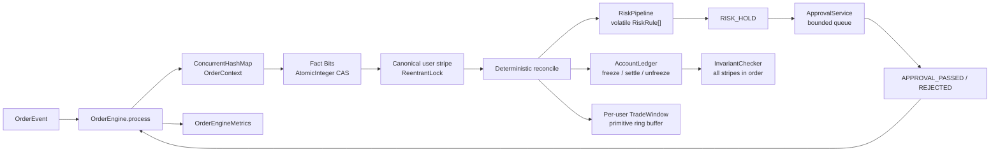

# CEX Core Engine

纯 Java 21 / JUC 的内存交易核心测评工程。项目围绕一个单资产、全成交订单生命周期展开，重点验证以下问题：订单事实乱序、重复投递、多线程竞争、异步审批、故障注入和严苛堆内存限制下，资产是否始终正确、状态是否最终收敛、系统是否能够被测量和解释。

本项目不实现完整撮合订单簿、网络协议、数据库持久化或生产级清算系统；它是一个可运行、可测试、可解释的核心状态处理样例。

## 设计目标

### 正确性目标

- 消息层允许 at-least-once、duplicate 和 out-of-order；资金副作用必须 exactly-once。
- `MATCH_FILLED`、`ORDER_CANCELLED`、审批结果可以早于 `ORDER_CREATED` 到达，系统先保存事实，待事实完整后再收敛。
- `available`、`frozen` 与 `systemSettledAmount` 的资产总量始终满足不变量。
- 重复消息不能造成重复冻结、重复结算、重复解冻或重复记录风控成交。
- 同一订单的元数据一旦建立，后续事件的 `userId` 和 `amount` 不允许不一致。

### 并发与性能目标

- 以用户为串行化边界，不使用全局订单锁；不同用户可以并行处理。
- 事实登记使用 CAS，资金事务使用 canonical striped lock，在正确性和锁竞争之间取得平衡。
- 审批使用有界队列，避免异步任务无界堆积。
- 在 `-Xmx256m` 下完成 500,000 次 benchmark 操作，并对吞吐、延迟和 GC 做实际采样。

### 可验证性目标

- Chaos 测试使用固定随机种子、16 个长生命周期 worker、watchdog、死锁检测和终止检测。
- 单元测试覆盖金额溢出、账本不变量、乱序状态机、终态冲突、审批、风险窗口、并发锁和指标统计。
- README 中的 Benchmark 与 Chaos 数据来自真实 `mvn clean test` 输出，不把测试阈值当成生产容量承诺。

## 项目结构

```text
cex-core-engine/
├── pom.xml
├── README.md
├── src/main/java/com/cex/core/
│   ├── account/
│   │   ├── Account.java                 # available / frozen 账户余额
│   │   ├── AccountLedger.java           # 冻结、结算、解冻和总资产
│   │   └── InvariantChecker.java        # 全 stripe 一致快照检查
│   ├── concurrent/
│   │   └── StripedLockManager.java      # 预创建的 canonical ReentrantLock stripes
│   ├── metrics/
│   │   ├── GcMetrics.java               # GC MXBean 快照
│   │   └── LatencyHistogram.java        # 固定 bucket 延迟统计
│   ├── order/
│   │   ├── OrderEvent.java              # 不可变订单事件
│   │   ├── OrderEngine.java             # 事实入口与 reconcile 核心
│   │   ├── OrderContext.java            # 元数据、Fact Bits、Effect Bits、状态
│   │   ├── OrderFact.java               # 观察事实位
│   │   ├── OrderEffect.java             # 已应用副作用位
│   │   ├── OrderStatus.java             # 派生状态枚举
│   │   └── OrderEngineMetrics.java      # LongAdder 指标
│   ├── risk/
│   │   ├── RiskPipeline.java            # volatile 规则数组 + copy-on-write
│   │   ├── RiskRule.java                # 风控规则接口
│   │   ├── TradeWindow.java             # primitive ring buffer 风控窗口
│   │   ├── SlidingWindowAmountRule.java # 10 秒成交金额规则
│   │   ├── ApprovalService.java         # 固定 worker + 有界队列
│   │   └── ApprovalTask.java            # 审批决策转事件
│   └── util/
│       └── MoneyMath.java               # checked long arithmetic
└── src/test/java/com/cex/core/
    ├── account/                         # 账本与不变量测试
    ├── chaos/                           # 乱序、重复、interrupt、watchdog
    ├── concurrent/                      # striped lock 测试
    ├── order/                           # 事实、元数据、状态机和冲突
    ├── performance/                     # 500k benchmark
    ├── risk/                            # 风控与审批
    └── util/                            # 金额运算
```

### 主要职责边界

| 组件 | 职责 | 不负责的事情 |
|---|---|---|
| `OrderEngine` | 接收事件、登记事实、按用户锁 reconcile、调度审批 | 网络重试、消息持久化、撮合 |
| `OrderContext` | 保存单订单的不可变元数据、事实位、效果位和派生状态 | 修改账户余额 |
| `AccountLedger` | 执行冻结、结算、解冻，维护总资产 | 决定订单状态 |
| `RiskPipeline` | 按顺序执行风控规则 | 执行资金副作用 |
| `ApprovalService` | 异步产生审批事件 | 直接修改订单或账本 |
| `InvariantChecker` | 在全量锁保护下检查快照 | 修复不变量错误 |

## 系统架构图



### 热路径

1. `OrderEngine.process(event)` 校验事件并在 `ConcurrentHashMap` 中创建或获取 `OrderContext`。
2. `OrderContext.registerFact` 通过 `AtomicInteger.compareAndSet` 登记事实位；重复事实只计数，不直接返回。
3. 根据 `userId` 获取 256 个 stripe 中的一个 canonical `ReentrantLock`。
4. 在锁内执行 `reconcile`：冻结、风控、审批调度、结算、解冻和状态迁移。
5. 释放用户锁后，审批任务才进入异步执行器；审批结果重新作为事件回到 `process`，不在 callback 中直接改领域对象。

## 订单状态机

### 状态与事实

订单状态不是单一可被消息覆盖的字段，而是以下信息的派生结果：

```text
Immutable Metadata
        +
Observed Fact Bits
        +
Applied Effect Bits
        |
        v
Derived OrderStatus
```

状态枚举只有：

| 状态 | 含义 | 资产含义 |
|---|---|---|
| `INIT` | 尚未完成正常订单初始化，或只收到乱序终态事实 | 不因乱序事实产生资金变化 |
| `NEW` | 创建已确认、冻结已完成、风控通过 | 订单金额处于 `frozen` |
| `RISK_HOLD` | 创建已确认、冻结已完成、风控要求审批 | 订单金额仍处于 `frozen` |
| `FILLED` | 成交事实已确认并完成结算 | `frozen` 减少，`systemSettledAmount` 增加 |
| `CANCELED` | 撤单或审批拒绝已确认并完成解冻 | `frozen` 减少，`available` 增加 |

事实位与事件的映射：

| 事件 | Fact Bit | 是否可以早于 `ORDER_CREATED` |
|---|---|---:|
| `ORDER_CREATED` | `CREATED_SEEN` | 否 |
| `MATCH_FILLED` | `FILLED_SEEN` | 是 |
| `ORDER_CANCELLED` | `CANCELLED_SEEN` | 是 |
| `APPROVAL_PASSED` | `APPROVED_SEEN` | 可以缓存 |
| `APPROVAL_REJECTED` | `REJECTED_SEEN` | 可以缓存 |

效果位与业务副作用的映射：

| Effect Bit | 副作用 | 幂等保护 |
|---|---|---|
| `FREEZE_APPLIED` | `available -= amount`、`frozen += amount` | 同一用户锁内 check/mutate/commit |
| `SETTLE_APPLIED` | `frozen -= amount`、`systemSettledAmount += amount` | 同一用户锁内只执行一次 |
| `UNFREEZE_APPLIED` | `frozen -= amount`、`available += amount` | 同一用户锁内只执行一次 |
| `RISK_RECORDED` | 将已结算金额写入 `TradeWindow` | 同一用户锁内只记录一次 |
| `APPROVAL_SCHEDULED` | 标记审批任务已提交 | 防止重复提交审批 |

### 完整 ASCII 状态转移图

<pre>
  [INIT: no CREATE fact]
       | ORDER_CREATED / freeze
       v
  [Risk Pipeline]
       | PASS                              | HOLD / schedule approval
       v                                   v
     [NEW]                             [RISK_HOLD]
       | MATCH_FILLED / settle             | APPROVAL_PASSED
       | + risk record                     v
       v                                  [NEW]
    [FILLED]                                |
       ^                                    | APPROVAL_REJECTED / unfreeze
       | late duplicate                     v
       |                                [CANCELED]
       |
       +-- late ORDER_CANCELLED: conflict metric, no unfreeze

  Out-of-order facts (no funds until CREATE arrives):

  [INIT]
    | MATCH_FILLED / cache FILLED_SEEN
    v
  [INIT + FILLED_SEEN] --ORDER_CREATED / freeze + settle + risk record--> [FILLED]

  [INIT]
    | ORDER_CANCELLED / cache CANCELLED_SEEN
    v
  [INIT + CANCELLED_SEEN] --ORDER_CREATED / freeze + unfreeze--> [CANCELED]

  [NEW] --ORDER_CANCELLED / unfreeze--> [CANCELED]
  Any state --duplicate fact--> same state, reconcile again, no duplicate effect
  [FILLED] + [CANCELED fact] --> [FILLED], conflict metric, no second terminal effect
  [CANCELED] + [FILLED fact] --> [CANCELED], conflict metric, no second terminal effect
</pre>

`FILLED` 和 `CANCELED` 同时出现时，互斥资金副作用以第一次成功提交的 Effect Bit 为准。如果两个终态事实在第一次 reconcile 前都已存在，代码按 `FILLED` 分支优先处理；如果某一终态已经先完成结算或解冻，后续相反事实只记录冲突，不执行第二个终态副作用。

## 状态机处理规则

### 1. 事件入口与元数据规则

- 所有事件必须经过 `OrderEngine.process`，不允许调用方直接操作 `OrderContext` 或 `AccountLedger`。
- 第一个事件创建 `OrderContext` 并固定 `orderId`、`userId`、`amount`。
- 后续事件必须通过 `validateMetadata`；元数据不一致抛出 `OrderMetadataMismatchException`，同时增加冲突指标。
- 金额统一使用 `long`，由 `MoneyMath` 使用 `Math.addExact` / `Math.subtractExact` 做 checked arithmetic。

### 2. 事实登记规则

`Fact Bits` 是单调集合，只允许从 0 增加为 1：

```text
current = factBits.get()
updated = current | eventMask
compareAndSet(current, updated)
```

CAS 失败时重试；如果位已经存在，返回 duplicate，但仍继续进入 reconcile。这样可以补偿“前一个线程已经登记事实、但还没有完成资金副作用”的并发窗口。

### 3. Reconcile 顺序

在同一用户 stripe 内，`OrderEngine` 按以下顺序收敛：

1. 检查 FILLED/CANCELED 冲突，以及 APPROVED/REJECTED 冲突。
2. 如果没有 `CREATED_SEEN`，只缓存事实并返回，不改变账户资金。
3. 如果没有 `FREEZE_APPLIED`，先执行一次冻结。
4. 如果存在 `FILLED_SEEN`，执行一次结算，记录一次风险成交，再迁移到 `FILLED`。
5. 否则如果存在 `REJECTED_SEEN` 或 `CANCELLED_SEEN`，执行一次解冻并迁移到 `CANCELED`。
6. 否则如果存在 `APPROVED_SEEN` 且不存在 `REJECTED_SEEN`，迁移到 `NEW`。
7. 否则执行风险规则：`PASS` 迁移到 `NEW`，`HOLD` 迁移到 `RISK_HOLD` 并最多调度一次审批。

这套顺序把“观察到什么”和“已经做过什么”分开处理，因此消息顺序不直接决定资金副作用次数。

### 4. 风控与审批规则

- `RiskPipeline` 读取 volatile 的 `RiskRule[]`，规则按注册顺序执行，遇到第一个 `HOLD` 即短路。
- 规则更新使用 synchronized copy-on-write；读路径不获取全局锁。
- `TradeWindow` 默认窗口为 10 秒，保存成功结算金额；`SlidingWindowAmountRule` 在最近窗口金额严格超过阈值时返回 `HOLD`。
- 审批使用固定 worker 和 `ArrayBlockingQueue`。队列满时 `CallerRunsPolicy` 提供有界背压。
- `ApprovalTask` 只产生 `APPROVAL_PASSED` 或 `APPROVAL_REJECTED`，审批结果重新进入 `OrderEngine.process`。

### 5. 重复和冲突规则

- 重复事实：计入 `duplicateEvents`，重新 reconcile，但 Effect Bit 已存在时不重复执行副作用。
- 乱序事实：计入 `outOfOrderEvents`，在缺少 CREATE 时只缓存。
- FILLED/CANCELED 冲突：计入 `conflictingTerminalEvents`，已完成的一侧获准，另一侧不再执行互斥副作用。
- APPROVED/REJECTED 冲突：计入 `approvalConflictEvents`；如果 REJECTED 已存在，则拒绝分支优先，避免审批通过后又执行拒绝资金操作。

## 并发模型

### 用户级 striped lock

`StripedLockManager` 预创建 256 个 `ReentrantLock`，通过 `Long.hashCode(userId) & (stripeCount - 1)` 计算 stripe：

```text
userId -> stripeIndex -> canonical ReentrantLock
```

- 同一用户的订单状态、账本余额、风控窗口和效果位在同一把锁下串行。
- 不同用户如果落在不同 stripe，可以并行；不为每个订单或每个事件创建锁。
- 该方案是低锁而非无锁：Fact 登记走 CAS，资金复合事务必须加锁。
- 热路径没有全局锁；全量锁只在 `InvariantChecker` 的一致快照期间使用。

### 共享数据结构

| 数据 | 容器/同步方式 | 访问规则 |
|---|---|---|
| 订单上下文 | `ConcurrentHashMap<Long, OrderContext>` | 元数据固定；事实 CAS；状态和效果在用户锁内改 |
| 账户 | `ConcurrentHashMap<Long, Account>` | 账户字段只在对应用户锁内修改 |
| 已结算总额 | `AtomicLong` | 结算在用户锁内执行，使用 CAS 保证 checked reserve |
| 风控窗口 | `ConcurrentHashMap<Long, TradeWindow>` | 窗口数组和 rolling sum 在用户锁内访问 |
| 风控规则 | volatile `RiskRule[]` | 读无锁，改规则时 copy-on-write |
| 指标 | `LongAdder` / `AtomicLong` | 只做观测，不参与领域决策 |

### 锁顺序与中断

- 普通交易：先获取一个用户 stripe，再执行订单和账本操作，释放后才提交审批任务。
- `InvariantChecker`：按 stripe `0 -> N-1` 获取，检查完成后按逆序释放；所有需要全量读取的路径遵守同一顺序。
- `AccountLedger.createAccount` 先获取用户 stripe，再进入 ledger monitor；因此不会形成 monitor -> stripe 的反向等待。
- 资金临界区使用 `lock.lock()`，不使用 `lockInterruptibly()`。Java interrupt 是协作式信号，不提供资金事务 rollback 语义；worker 即使收到 interrupt，也必须完成已接受的资金操作。
- 临界区内不执行 IO、sleep、park 或审批 callback，降低长时间持锁和死锁风险。

## 资产一致性证明

### 不变量定义

设：

- `A_i`：用户 `i` 的 `available`；
- `F_i`：用户 `i` 的 `frozen`；
- `S`：`systemSettledAmount`；
- `T0`：建户和初始系统结算额确定后的 `initialTotalAsset`。

系统要求始终满足：

```text
Σ(A_i + F_i) + S = T0
```

### 每个资金操作的守恒关系

| 操作 | 变化 | 总量变化 |
|---|---|---:|
| 建户 | `T0 += available + frozen`，同时新增账户余额 | 0 |
| Freeze(x) | `A_i -= x`，`F_i += x` | 0 |
| Unfreeze(x) | `F_i -= x`，`A_i += x` | 0 |
| Settle(x) | `F_i -= x`，`S += x` | 0 |
| 重复 Effect | 不再执行 mutation | 0 |

因此，如果初始状态满足不变量，且所有变更只通过上述原子业务操作发生，则每次操作后仍满足不变量。

### 为什么并发下仍成立

1. 同一用户的 `A_i/F_i` 变化由同一 stripe 串行化。
2. `Effect check -> mutation -> Effect commit` 在同一临界区内完成，重复事件不能绕过效果位再次扣款。
3. `settleLocked` 在减少 frozen 前先 CAS 预留 `systemSettledAmount`；余额不足或算术溢出不会留下半个结算。
4. `InvariantChecker` 获取全部 stripe 后再读取账户集合和初始总量，避免读到一半冻结、一半解冻的混合快照。
5. `MoneyMath` 的 checked arithmetic 将 long 溢出转化为异常，而不是静默破坏总量。

测试不只检查最终值，还在 Chaos 运行期间由 watchdog 周期性调用 `InvariantChecker.check()`；最终同时断言失败次数为 0、总量差为 0、无死锁、所有 worker 终止。

## 乱序事件收敛方案

### 收敛模型

事件到达顺序与业务因果顺序分离：

```text
event arrival
    -> validate immutable metadata
    -> register monotonic fact
    -> lock user stripe
    -> reconcile complete fact set + effect set
    -> unlock
    -> optionally enqueue approval
```

对于同一订单、同一元数据、非冲突事实集合，最终状态由事实集合和已提交效果集合决定，而不是由某条消息是否重复决定。效果位使 reconcile 可重复执行。

### 典型乱序场景

#### MATCH 先于 CREATE

```text
MATCH_FILLED
  -> FILLED_SEEN = 1
  -> status 仍为 INIT
  -> 不冻结、不结算

ORDER_CREATED
  -> CREATED_SEEN = 1
  -> freeze 一次
  -> settle 一次
  -> RISK_RECORDED 一次
  -> FILLED
```

#### CANCEL 先于 CREATE

```text
ORDER_CANCELLED
  -> CANCELLED_SEEN = 1
  -> status 仍为 INIT
  -> 不冻结、不解冻

ORDER_CREATED
  -> CREATED_SEEN = 1
  -> freeze 一次
  -> unfreeze 一次
  -> CANCELED
```

#### Duplicate 与并发重复

两个线程可能同时看到同一个事实未登记，也可能一个线程刚登记事实、另一个线程先开始 reconcile。CAS 保证事实位只成功登记一次；用户锁保证效果位和账本操作只成功提交一次，重复事件仍会执行一次补偿式 reconcile。

#### 终态冲突

`MATCH_FILLED` 与 `ORDER_CANCELLED` 都是合法事实，但缺少外部撮合序列号时无法推断真实权威顺序。实现不做双重资金操作：第一次成功完成结算或解冻的一侧保留，后一侧只增加冲突指标。生产系统若需要严格权威裁决，应引入每订单单调 sequence/version。

## 内存优化方案

Maven Surefire 的运行参数为：

```text
-Xms128m -Xmx256m -XX:+UseG1GC
```

### 对象和数据结构策略

- 金额、ID、时间和状态位使用 primitive `long` / `int` / bit mask，金额不使用 `BigDecimal`。
- `TradeWindow` 使用 primitive `long[]` 时间戳和金额环形数组，维护 `head`、`size`、`rollingSum`；窗口淘汰后复用环槽，不保存完整成交事件历史。
- `LatencyHistogram` 使用固定 bucket 和 `LongAdder`，不创建 500,000 个 boxed latency 样本。
- Chaos 使用 16 个长生命周期 worker，而不是为每条测试事件创建 pending Runnable。
- Benchmark 预先创建 16 个可重复使用的 duplicate event 对象，并先执行 50,000 次 warmup，再执行 500,000 次测量。
- `StripedLockManager` 的 256 把锁、每用户 `TradeWindow`、风险规则数组和统计结构在生命周期内复用；审批队列使用 `ArrayBlockingQueue` 限制待处理任务数量。
- 不引入全局事件对象池：池化可能延长对象存活和引用链，增加归还竞态；本实现优先复用固定数组和有限容量结构，让 G1 回收短生命周期事件。

### GC 观测

`GcMetrics` 在 Benchmark 前后读取 `GarbageCollectorMXBean`，报告总 GC 次数/时间和 old/mixed collector 次数/时间。报告数据是一次运行的观测值，不代表所有机器都获得相同 GC 数字。

## Benchmark 结果

### 测试方法

- 测试类：`PerformanceTest`
- JDK：Microsoft OpenJDK 21.0.12
- JVM 堆：`-Xms128m -Xmx256m -XX:+UseG1GC`
- 并发线程：16
- Warmup：50,000 次
- Measurement：500,000 次
- 负载：重复处理已完成订单的 `MATCH_FILLED` 事件，验证幂等热路径
- 断言阈值：TPS `>= 10,000`，平均延迟 `< 1ms`

### 最近一次实测输出

| 指标 | 结果 |
|---|---:|
| Measurement Operations | 500,000 |
| Threads | 16 |
| TPS | 7,723,236.28 |
| Average latency | 1.50 us |
| P50 | 10.0 us |
| P95 | 10.0 us |
| P99 | 25.0 us |
| MAX | 1,711.8 us |
| Heap Max | 256 MB |
| Heap Used | 199 MB |
| GC Count | 1 |
| GC Time | 1 ms |
| Old/Full GC Count | 0 |
| Old/Full GC Time | 0 ms |

TPS、调度和堆使用量会受到 JIT、CPU、系统调度及测试顺序影响；该结果用于证明实现满足测评阈值，不应直接当作生产容量规划。

## Chaos 测试结果

### 测试方法

测试类：`ChaosInvariantTest`。

- 固定种子：`20260816`，可通过 `-DCHAOS_SEED` 覆盖。
- 订单数：270,000；每个用户预置 2 个资产单位。
- worker：16 个固定线程，长生命周期执行订单循环。
- 每个订单生成 CREATE 和 MATCH；部分订单先发 MATCH 再发重复 MATCH 再发 CREATE，其他订单先发重复 CREATE 再发 MATCH。
- 每 17 个订单注入一次 `Thread.interrupt()`；每 256 个订单注入 `Thread.yield()` 和 `LockSupport.parkNanos(1)`。
- watchdog 每 1ms 检查一次资产不变量；worker 每 1024 次操作额外检查一次。
- 结束时调用 `ThreadMXBean.findDeadlockedThreads()`，并验证 worker 和 watchdog 都能终止。

### 最近一次实测输出

| 指标 | 结果 |
|---|---:|
| CHAOS SEED | 20260816 |
| Processed events | 825,883 |
| Accepted facts | 540,000 |
| Duplicate events | 285,883 |
| Out-of-order events | 27,000 |
| State transitions | 526,500 |
| Freeze count | 270,000 |
| Settle count | 270,000 |
| Unfreeze count | 0 |
| Invariant snapshots | 393 |
| Invariant failures | 0 |
| Deadlock check | PASS |
| Termination check | PASS |

Chaos 的关键验收条件是：`stateTransitions >= 500,000`、`invariantFailures == 0`、总资产差为 0、死锁检查为空、worker 正常终止、每个订单恰好结算一次。

## 构建和完整验证

### 环境要求

- JDK 21；本机验证路径：`C:\Users\10703\.jdks\ms-21.0.12`
- Maven 3.9+
- Windows PowerShell 示例：

```powershell
$env:JAVA_HOME='C:/Users/10703/.jdks/ms-21.0.12'
$env:Path="$env:JAVA_HOME/bin;$env:Path"
java -version
mvn -version
```

### 完整命令

```powershell
mvn clean test
```

当前完整测试矩阵：

| 测试类 | 覆盖内容 |
|---|---|
| `MoneyMathTest` | checked arithmetic、正数和非负数校验 |
| `LedgerInvariantTest` | freeze、settle、unfreeze、溢出、失败原子性和并发账本 |
| `InvariantCheckerTest` | 全 stripe 一致快照 |
| `StripedLockManagerTest` | stripe 映射和锁数量 |
| `OrderContextTest` | Fact Bits、Effect Bits 和状态上下文 |
| `OrderMetadataTest` | 元数据固定与冲突拒绝 |
| `OutOfOrderStateMachineTest` | CREATE/MATCH/CANCEL 乱序收敛 |
| `TerminalConflictTest` | FILLED/CANCELED 终态冲突 |
| `RiskEngineTest` | 风险窗口、规则动态更新和 HOLD |
| `ApprovalTest` | 有界审批队列、审批事件回流和 quiescence |
| `ChaosInvariantTest` | 16 worker、重复、乱序、interrupt、watchdog、死锁 |
| `PerformanceTest` | 500k 操作、延迟、吞吐、堆和 GC |

最近一次完整验证结果：

```text
Tests run: 38, Failures: 0, Errors: 0, Skipped: 0
BUILD SUCCESS
```

## 使用边界

### 当前明确支持

- 单资产余额模型：`available`、`frozen`、`systemSettledAmount`。
- 全成交订单：一个订单最多执行一次 freeze、settle 或 unfreeze。
- at-least-once、duplicate、out-of-order 事件处理。
- 风控规则的运行时注册、移除和替换。
- 10 秒成交金额窗口和异步审批结果回流。
- 进程内并发一致性、死锁检测、内存和 GC 测量。

### 当前不支持或有意简化

- 不实现 partial fill、多个 `TradeId`、撮合订单簿或撮合优先级。
- 不实现 base/quote 双资产的完整交易清算，只维护题目所需的单资产总量模型。
- 不包含数据库、WAL、事件日志、跨进程恢复或 crash recovery；Fact Bits 和 Effect Bits 只在当前 JVM 生命周期内有效。
- 不包含网络协议、鉴权、限流、幂等键持久化或消息 broker 语义。
- 订单元数据必须在同一订单内保持一致；生产系统应由外部 schema/version 和持久化序列保证这一点。
- 终态冲突没有权威撮合序列号时只能采用“先成功副作用获胜”的本地策略；生产系统应引入 per-order monotonic sequence/version。
- Benchmark 是内存状态机热路径测量，不代表端到端交易所吞吐，也不包含网络、序列化、数据库和撮合开销。

如果将该工程扩展到生产交易系统，下一步应优先补充：持久化事实日志与恢复协议、权威事件序列、双资产清算模型、跨服务幂等、监控告警和故障恢复演练。
