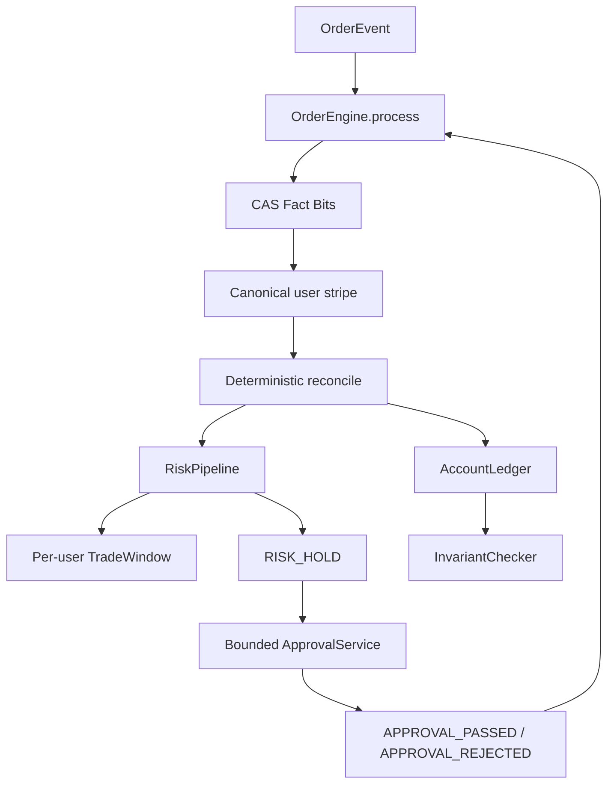

# CEX Core Technical Assessment

纯 Java 21 / JUC 的内存交易核心测评工程。重点是订单事实乱序、重复投递、高并发和故障注入下的资产正确性；不实现完整撮合订单簿、网络协议或持久化系统。

## 1. Overview

- 金额热路径统一使用 primitive `long`，所有加减使用 checked arithmetic。
- `OrderEvent` 通过 `OrderEngine.process` 进入统一事实入口。
- Fact Bits 表达已观察事实，Effect Bits 表达已经完成的资金副作用；二者严格分离。
- 同一用户的账户、订单副作用和 TradeWindow 共用一个 canonical striped lock。
- Risk Pipeline 使用 volatile copy-on-write 规则数组；Approval 使用有界异步执行器并重新投递审批事件。
- Chaos 测试使用 16 个长生命周期 worker，持续检查资产不变量，并确定性产生超过 500,000 次真实状态迁移。

## 2. Requirements Mapping

| Assessment requirement | Implementation |
|---|---|
| Asset consistency | `AccountLedger` + `InvariantChecker` |
| Out-of-order state machine | `OrderContext` Fact Bits + `OrderEngine` reconciliation |
| Idempotency | CAS fact registration + lock-protected Effect Bits |
| Fine-grained concurrency | One canonical `StripedLockManager` |
| Dynamic risk workflow | `RiskPipeline` + ordered `RiskRule[]` |
| 10-second window | `TradeWindow` primitive ring buffer + `SlidingWindowAmountRule` |
| Async approval | `ApprovalService` + `ApprovalTask` |
| Chaos/failure handling | `ChaosInvariantTest` |
| 500k real transitions | deterministic `stateTransitions` assertion |
| Performance | `PerformanceTest` + `LatencyHistogram` + `GcMetrics` |
| Memory | primitive fields, bounded queues, no event history, `-Xmx256m` |

## 3. Architecture



`OrderEngine` 先登记事实，再进入 user stripe。资金 mutation 与 Effect commit 在同一个临界区；Approval 的提交和 callback 在释放 stripe 后进行。

## 4. State / Fact Model

订单不是单一 `status` 字段，而是：

```text
Immutable Metadata
+ Observed Fact Bits
+ Applied Effect Bits
+ Derived OrderStatus
```

状态枚举严格为 `INIT`、`NEW`、`RISK_HOLD`、`FILLED`、`CANCELED`。乱序消息不会伪造额外状态，而是先缓存事实，待 CREATE 补齐后统一 reconcile。

### Fact Combination

| CREATED | FILLED | CANCELLED | Result |
|---:|---:|---:|---|
| 0 | 0 | 0 | `INIT`, 等待 CREATE |
| 0 | 1 | 0 | `INIT`, 缓存成交事实 |
| 0 | 0 | 1 | `INIT`, 缓存撤单事实 |
| 1 | 1 | 0 | `FILLED` |
| 1 | 0 | 1 | `CANCELED` |
| 1 | 1 | 1 | External terminal conflict；禁止双副作用 |

## 5. Complete Out-of-Order State Transition

状态机不是按消息到达顺序直接覆盖 `status`，而是先登记 Fact Bits，再由 reconcile 根据完整事实集合和 Effect Bits 收敛。下面的 ASCII 图覆盖正常路径、两种乱序路径、审批路径、重复消息和终态冲突：

```text
  [INIT: no CREATE fact]
       | ORDER_CREATED / freeze
       v
  [Risk Pipeline]
       | PASS                              | HOLD / schedule approval
       v                                   v
     [NEW]                             [RISK_HOLD]
       | MATCH_FILLED / settle             | APPROVAL_PASSED
       | + risk record                     v
       v                                  [NEW]
    [FILLED]                                |
       ^                                    | APPROVAL_REJECTED / unfreeze
       | late duplicate                     v
       |                                [CANCELED]
       |
       +-- late ORDER_CANCELLED: conflict metric, no unfreeze

  Out-of-order facts (no funds until CREATE arrives):

  [INIT]
    | MATCH_FILLED / cache FILLED_SEEN
    v
  [INIT + FILLED_SEEN] --ORDER_CREATED / freeze + settle + risk record--> [FILLED]

  [INIT]
    | ORDER_CANCELLED / cache CANCELLED_SEEN
    v
  [INIT + CANCELLED_SEEN] --ORDER_CREATED / freeze + unfreeze--> [CANCELED]

  [NEW] --ORDER_CANCELLED / unfreeze--> [CANCELED]
  Any state --duplicate fact--> same state, reconcile again, no duplicate effect
  [FILLED] + [CANCELED fact] --> [FILLED], conflict metric, no second terminal effect
  [CANCELED] + [FILLED fact] --> [CANCELED], conflict metric, no second terminal effect
```

`MATCH_FILLED` 或 `ORDER_CANCELLED` 先到达时只登记事实，不冻结资金；`ORDER_CREATED` 到达后统一执行一次冻结，再根据已观察事实执行结算或解冻。若 FILLED 与 CANCELED 同时存在，当前实现保留先完成的合法终态副作用，第二个互斥副作用被 Effect Bits 阻止并计入冲突指标。成交事实已先于 CREATE 到达时，结算侧不再反向进入本地 Risk Hold；该事实代表外部撮合已确认成交。

## 6. Exactly-Once Asset Effects

消息层允许 at-least-once、duplicate 和 out-of-order；业务副作用要求 exactly-once。实现依靠：

1. Fact registration 是单调 CAS；重复 fact 只增加 duplicate metric。
2. 重复事件不能直接 return，仍然进入补偿式 reconcile。
3. `FREEZE_APPLIED`、`SETTLE_APPLIED`、`UNFREEZE_APPLIED` 等 Effect Bits 独立于 Facts。
4. `check effect + ledger mutation + effect commit` 位于同一 canonical user stripe。
5. 只有 mutation 成功后 `applyEffectLocked` 才提交 bit。

## 7. Concurrency, Data Structures and Interrupt Model

### 极端乱序下的一致性

- `OrderContext.factBits` 是 `AtomicInteger`，每个事实只允许通过 CAS 从 `0` 变为 `1`；乱序消息只补齐事实集合，不会把状态回退或伪造中间状态。
- Fact Bits 与 Effect Bits 分离。`FREEZE_APPLIED`、`SETTLE_APPLIED`、`UNFREEZE_APPLIED`、`RISK_RECORDED` 和 `APPROVAL_SCHEDULED` 分别记录副作用是否已经完成；重复消息即使重新进入 reconcile，也不会重复扣款、解冻或记录成交。
- 事实登记是无锁的；事实登记之后一定进入 reconcile，避免“重复事件直接 return”导致上一线程只登记事实、尚未完成副作用时没有补偿机会。
- `ConcurrentHashMap<Long, OrderContext>` 保存订单上下文，`ConcurrentHashMap<Long, TradeWindow>` 保存每个用户唯一的窗口对象；订单元数据首次建立后保持不可变，后续事件元数据不一致会拒绝。

### 低锁方案与锁顺序

- `StripedLockManager` 预创建 256 个 `ReentrantLock`，通过 userId 的 hash 映射到 canonical stripe。相同用户严格串行，不同 stripe 可并行；不为每个事件创建锁，也没有全局订单锁。
- `OrderContext` 的状态、Effect Bits、账户 `available/frozen`、用户 TradeWindow 的 `head/size/rollingSum` 都在同一个 user stripe 内更新。冻结的“available 减少 + frozen 增加”、结算的“frozen 减少 + systemSettled 增加”和解冻均为一个不可拆分的业务临界区。
- `Effect check -> ledger mutation -> Effect commit` 在同一 stripe 中完成；只有 mutation 成功才提交 Effect Bit。结算还会先用 CAS 预留 `systemSettledAmount`，避免溢出或余额错误造成部分更新。
- 账户表与 system total 只在建户的 user stripe 及 ledger monitor 下更新；`InvariantChecker` 按 stripe `0 -> N-1` 顺序全量加锁，读取一致快照后逆序释放，避免多锁反向获取造成死锁。普通交易路径不获取全量锁。
- Approval worker 使用固定线程数和 `ArrayBlockingQueue`；审批只生成 `APPROVAL_PASSED` / `APPROVAL_REJECTED` 事件，在释放 user stripe 后重新进入 `OrderEngine.process`，不在异步线程直接改领域状态。

核心资金临界区使用 `lock.lock()`，不使用 `lockInterruptibly()`；Java interrupt 只是协作式信号，不具备资金 rollback 语义。临界区内没有 IO、sleep、park 或 Approval callback。收到中断的 worker 仍完成已经接受的事件。

## 8. Dynamic Risk Workflow

`RiskPipeline` 读取 volatile 的规则数组，注册/删除/替换走低频 copy-on-write 更新；读取路径无全局锁并按顺序 short-circuit。`TradeWindow` 只在对应 user stripe 下访问，使用 primitive timestamp/amount 数组、head、size 和 rolling sum。`SlidingWindowAmountRule` 判断最近 10 秒已成功 settle 的金额是否严格超过阈值。

Approval 由固定 worker 数和 `ArrayBlockingQueue` 组成，使用 `CallerRunsPolicy` 做有界背压。它只产生 `APPROVAL_PASSED` 或 `APPROVAL_REJECTED`，结果重新进入 `OrderEngine.process`，不直接改 OrderContext、Account、Ledger 或 TradeWindow。

## 9. Asset Invariant

```text
Σ(account.available + account.frozen) + systemSettledAmount
= initialTotalAsset
```

`InvariantChecker` 按 stripe `0 -> N` 顺序获取全部锁，读取一致快照后按逆序释放。Chaos 运行期间 watchdog 周期性检查，结束时再做最终检查；PerformanceTest 不启用 watchdog。

## 10. Chaos / Failure Injection

- 16 个长生命周期 worker，而不是 500,000 个 pending Runnable。
- 固定 `CHAOS_SEED`，默认 `20260816`，可用 system property 覆盖。
- 生成 CREATE/MATCH 合法生命周期，随机改变顺序并重复事件。
- 注入 `interrupt`、`Thread.yield()`、`LockSupport.parkNanos()`；故障点位于资金临界区之外。
- `awaitTermination` 超时和 `ThreadMXBean.findDeadlockedThreads()` 同时检查。
- 最终断言 `invariantFailures == 0`、`deadlockedThreads == null`、`stateTransitions >= 500000`。

## 11. Memory / GC Optimization under `-Xmx256m`

内存上限按 Maven Surefire 的 `-Xms128m -Xmx256m -XX:+UseG1GC` 执行。设计目标不是“零分配”，而是在 500k 级别事件、16 个 worker 和审批队列存在时保持对象数量有界、避免历史数据线性增长：

- 金额、ID、时间和状态位使用 primitive `long` / `int` / bit mask；热路径不使用 `BigDecimal`、反射、序列化或 boxed latency 样本。
- `TradeWindow` 使用固定容量的 primitive `long[]` 时间戳/金额环形数组，成交记录复用环槽；过期记录从 head 淘汰，`rollingSum` 增量维护，不保留完整事件历史。
- `LatencyHistogram` 使用固定 bucket 计数，复用计数数组；`GcMetrics` 只保存计数器和本次测试的汇总值，不保存每次 GC 或每次延迟对象。
- 256 个 canonical `ReentrantLock`、每用户 `TradeWindow`、volatile copy-on-write 的规则数组在生命周期内复用；规则读取不创建临时集合。Approval 使用有界 `ArrayBlockingQueue`，队列满时 `CallerRunsPolicy` 让提交线程承担任务，防止 pending task 无界堆积。
- 订单上下文只保留当前事实位、效果位和少量元数据，不保留事件列表；测试使用 16 个长生命周期 worker，而不是为 500k 个事件创建 500k 个待执行 Runnable。
- 不引入全局事件对象池：池化会延长对象引用存活、增加并发归还复杂度；本实现优先复用固定数组、锁、窗口和统计结构，并让短生命周期事件在 G1 下自然回收。
- G1 在 Java 21 下负责小堆下的分区回收；`GcMetrics` 输出 collector count/time，测试报告实际 heap、GC 和 Full GC 数据，不无证据宣称 zero allocation 或 Full GC 为零。

## 12. Assumptions / Trade-offs

- 题目只实现 full fill，不扩展 partial fill、TradeId、撮合订单簿、双边 base/quote 结算。
- `systemSettledAmount` 是题目单资产不变量中的系统已成交总资金，不是生产交易所完整清算模型。
- Risk Hold 时资金保持 frozen；Approval PASS 不重复 freeze，REJECT 只 unfreeze 一次。
- 无数据库时，“落库”解释为进入正式可交易的内存状态。
- FILLED/CANCELED 同时到达缺少权威 matching sequence；本实现保留先完成的合法副作用，记录 conflict，并禁止第二次互斥资金副作用。生产系统应提供 per-order monotonic sequence/version 做权威裁决。

## 13. Test Matrix

- `MoneyMathTest`
- `LedgerInvariantTest`
- `InvariantCheckerTest`
- `OrderMetadataTest`
- `OrderContextTest`
- `OutOfOrderStateMachineTest`
- `TerminalConflictTest`
- `RiskEngineTest`
- `ApprovalTest`
- `ChaosInvariantTest`
- `PerformanceTest`

## 14. Measured Performance Result

以下为一次 `mvn clean test` 在本机 JDK 21、Surefire `-Xmx256m` 下的真实输出：

```text
Measurement Operations: 500000
Threads:                16
TPS:                    8470613.75
Average latency:        1.31 us
P50:                    10.0 us
P95:                    10.0 us
P99:                    25.0 us
MAX:                    712.9 us
Heap Max:               256 MB
Heap Used:              44 MB
GC Count:               1
GC Time:                1 ms
Old/Full GC Count:      0
Old/Full GC Time:       0 ms
```

该结果是当前机器的一次观测值，会受 JIT、CPU 和调度影响；测试仍对 TPS `>= 10000` 和平均延迟 `< 1ms` 做真实断言。

## 15. Build and Acceptance

当前机器默认 Maven 可能仍指向旧 JDK，因此使用本机已安装的 JDK 21 执行：

```powershell
$env:JAVA_HOME='C:/Users/10703/.jdks/ms-21.0.12'
$env:Path='C:/Users/10703/.jdks/ms-21.0.12/bin;' + $env:Path
mvn clean test
```

最近一次完整验收：`Tests run: 38, Failures: 0, Errors: 0, Skipped: 0`。

## 16. Interview Notes

**为什么不全部 CAS？** Fact 是单变量单调位登记；available/frozen 是多字段业务事务，必须使用 user stripe。

**为什么 duplicate event 不能直接 return？** Fact 可能已经登记但上一线程尚未完成 reconcile；重复投递是补偿机会。

**MATCH 为什么能先于 CREATE？** 消息到达顺序不等于业务因果顺序；先保存事实，CREATE 到达后统一收敛。

**如何防止重复扣款？** Fact 与 Effect 分离，Effect check/mutate/commit 在同一 stripe；重复事件仍 reconcile 但不会重复 mutation。

**为什么 interrupt 不回滚？** Java interrupt 没有资金事务 rollback 语义；关键临界区必须完整执行。

**为什么 InvariantChecker 全量加锁？** 无锁遍历会读取跨时刻混合快照；全 stripe 顺序获取给出一致视图且避免反向多锁死锁。

**为什么 RiskWindow 复用 user stripe？** 成交记录、过期淘汰、rolling sum 和下单风控判断属于同一用户业务串行域。
