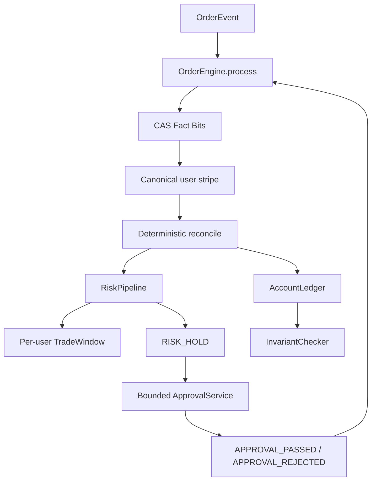

# CEX Core Technical Assessment

纯 Java 17 / JUC 的内存交易核心测评工程。重点是订单事实乱序、重复投递、高并发和故障注入下的资产正确性；不实现完整撮合订单簿、网络协议或持久化系统。

## 1. Overview

- 金额热路径统一使用 primitive `long`，所有加减使用 checked arithmetic。
- `OrderEvent` 通过 `OrderEngine.process` 进入统一事实入口。
- Fact Bits 表达已观察事实，Effect Bits 表达已经完成的资金副作用；二者严格分离。
- 同一用户的账户、订单副作用和 TradeWindow 共用一个 canonical striped lock。
- Risk Pipeline 使用 volatile copy-on-write 规则数组；Approval 使用有界异步执行器并重新投递审批事件。
- Chaos 测试使用 16 个长生命周期 worker，持续检查资产不变量，并确定性产生超过 500,000 次真实状态迁移。

## 2. Requirements Mapping

| Assessment requirement | Implementation |
|---|---|
| Asset consistency | `AccountLedger` + `InvariantChecker` |
| Out-of-order state machine | `OrderContext` Fact Bits + `OrderEngine` reconciliation |
| Idempotency | CAS fact registration + lock-protected Effect Bits |
| Fine-grained concurrency | One canonical `StripedLockManager` |
| Dynamic risk workflow | `RiskPipeline` + ordered `RiskRule[]` |
| 10-second window | `TradeWindow` primitive ring buffer + `SlidingWindowAmountRule` |
| Async approval | `ApprovalService` + `ApprovalTask` |
| Chaos/failure handling | `ChaosInvariantTest` |
| 500k real transitions | deterministic `stateTransitions` assertion |
| Performance | `PerformanceTest` + `LatencyHistogram` + `GcMetrics` |
| Memory | primitive fields, bounded queues, no event history, `-Xmx256m` |

## 3. Architecture



`OrderEngine` 先登记事实，再进入 user stripe。资金 mutation 与 Effect commit 在同一个临界区；Approval 的提交和 callback 在释放 stripe 后进行。

## 4. State / Fact Model

订单不是单一 `status` 字段，而是：

```text
Immutable Metadata
+ Observed Fact Bits
+ Applied Effect Bits
+ Derived OrderStatus
```

状态枚举严格为 `INIT`、`NEW`、`RISK_HOLD`、`FILLED`、`CANCELED`。乱序消息不会伪造额外状态，而是先缓存事实，待 CREATE 补齐后统一 reconcile。

### Fact Combination

| CREATED | FILLED | CANCELLED | Result |
|---:|---:|---:|---|
| 0 | 0 | 0 | `INIT`, 等待 CREATE |
| 0 | 1 | 0 | `INIT`, 缓存成交事实 |
| 0 | 0 | 1 | `INIT`, 缓存撤单事实 |
| 1 | 1 | 0 | `FILLED` |
| 1 | 0 | 1 | `CANCELED` |
| 1 | 1 | 1 | External terminal conflict；禁止双副作用 |

## 5. Complete State Flows

### MATCH before CREATE

```text
MATCH_FILLED -> INIT + FILLED_SEEN (no funds)
ORDER_CREATED -> freeze once -> settle once -> risk record once -> FILLED
```

### CANCEL before CREATE

```text
ORDER_CANCELLED -> INIT + CANCELLED_SEEN (no funds)
ORDER_CREATED -> freeze once -> unfreeze once -> CANCELED
```

### Normal and Risk

```text
INIT --CREATE/freeze--> Risk Pipeline --PASS--> NEW
                                      \--HOLD--> RISK_HOLD
NEW --MATCH_FILLED/settle--> FILLED
NEW --ORDER_CANCELLED/unfreeze--> CANCELED
RISK_HOLD --APPROVAL_PASSED--> NEW
RISK_HOLD --APPROVAL_REJECTED/unfreeze--> CANCELED
```

成交事实已先于 CREATE 到达时，结算侧不再反向进入本地 Risk Hold；该事实代表外部撮合已确认成交。

## 6. Exactly-Once Asset Effects

消息层允许 at-least-once、duplicate 和 out-of-order；业务副作用要求 exactly-once。实现依靠：

1. Fact registration 是单调 CAS；重复 fact 只增加 duplicate metric。
2. 重复事件不能直接 return，仍然进入补偿式 reconcile。
3. `FREEZE_APPLIED`、`SETTLE_APPLIED`、`UNFREEZE_APPLIED` 等 Effect Bits 独立于 Facts。
4. `check effect + ledger mutation + effect commit` 位于同一 canonical user stripe。
5. 只有 mutation 成功后 `applyEffectLocked` 才提交 bit。

## 7. Concurrency and Interrupt Model

Fact bit 是单变量 `0 -> 1`，使用 CAS；`available -= amount` 与 `frozen += amount` 是复合资金事务，使用 user-level `ReentrantLock`。不同 stripe 的用户可以并行，同一用户严格串行。

核心资金临界区使用 `lock.lock()`，不使用 `lockInterruptibly()`；Java interrupt 只是协作式信号，不具备资金 rollback 语义。临界区内没有 IO、sleep、park 或 Approval callback。收到中断的 worker 仍完成已经接受的事件。

## 8. Dynamic Risk Workflow

`RiskPipeline` 读取 volatile 的规则数组，注册/删除/替换走低频 copy-on-write 更新；读取路径无全局锁并按顺序 short-circuit。`TradeWindow` 只在对应 user stripe 下访问，使用 primitive timestamp/amount 数组、head、size 和 rolling sum。`SlidingWindowAmountRule` 判断最近 10 秒已成功 settle 的金额是否严格超过阈值。

Approval 由固定 worker 数和 `ArrayBlockingQueue` 组成，使用 `CallerRunsPolicy` 做有界背压。它只产生 `APPROVAL_PASSED` 或 `APPROVAL_REJECTED`，结果重新进入 `OrderEngine.process`，不直接改 OrderContext、Account、Ledger 或 TradeWindow。

## 9. Asset Invariant

```text
Σ(account.available + account.frozen) + systemSettledAmount
= initialTotalAsset
```

`InvariantChecker` 按 stripe `0 -> N` 顺序获取全部锁，读取一致快照后按逆序释放。Chaos 运行期间 watchdog 周期性检查，结束时再做最终检查；PerformanceTest 不启用 watchdog。

## 10. Chaos / Failure Injection

- 16 个长生命周期 worker，而不是 500,000 个 pending Runnable。
- 固定 `CHAOS_SEED`，默认 `20260816`，可用 system property 覆盖。
- 生成 CREATE/MATCH 合法生命周期，随机改变顺序并重复事件。
- 注入 `interrupt`、`Thread.yield()`、`LockSupport.parkNanos()`；故障点位于资金临界区之外。
- `awaitTermination` 超时和 `ThreadMXBean.findDeadlockedThreads()` 同时检查。
- 最终断言 `invariantFailures == 0`、`deadlockedThreads == null`、`stateTransitions >= 500000`。

## 11. Memory / GC

- 金额、ID、时间和状态位使用 primitive 字段/bit mask。
- 不使用 `BigDecimal`、event history、500k boxed latency 数组或 500k pending tasks。
- Risk window 使用 primitive arrays；Approval queue 有界；latency 使用固定 buckets。
- Maven Surefire 设置 `-Xms128m -Xmx256m -XX:+UseG1GC`。
- `GcMetrics` 输出 collector count/time；不会无证据宣称 zero allocation 或 Full GC 为零。

## 12. Assumptions / Trade-offs

- 题目只实现 full fill，不扩展 partial fill、TradeId、撮合订单簿、双边 base/quote 结算。
- `systemSettledAmount` 是题目单资产不变量中的系统已成交总资金，不是生产交易所完整清算模型。
- Risk Hold 时资金保持 frozen；Approval PASS 不重复 freeze，REJECT 只 unfreeze 一次。
- 无数据库时，“落库”解释为进入正式可交易的内存状态。
- FILLED/CANCELED 同时到达缺少权威 matching sequence；本实现保留先完成的合法副作用，记录 conflict，并禁止第二次互斥资金副作用。生产系统应提供 per-order monotonic sequence/version 做权威裁决。

## 13. Test Matrix

- `MoneyMathTest`
- `LedgerInvariantTest`
- `InvariantCheckerTest`
- `OrderMetadataTest`
- `OrderContextTest`
- `OutOfOrderStateMachineTest`
- `TerminalConflictTest`
- `RiskEngineTest`
- `ApprovalTest`
- `ChaosInvariantTest`
- `PerformanceTest`

## 14. Measured Performance Result

以下为一次 `mvn clean test` 在本机 JDK 17、Surefire `-Xmx256m` 下的真实输出：

```text
Measurement Operations: 500000
Threads:                16
TPS:                    9530453.61
Average latency:        1.06 us
P50:                    10.0 us
P95:                    10.0 us
P99:                    25.0 us
MAX:                    846.4 us
Heap Max:               256 MB
Heap Used:              199 MB
GC Count:               1
GC Time:                1 ms
Old/Full GC Count:      0
Old/Full GC Time:       0 ms
```

该结果是当前机器的一次观测值，会受 JIT、CPU 和调度影响；测试仍对 TPS `>= 10000` 和平均延迟 `< 1ms` 做真实断言。

## 15. Build and Acceptance

当前机器默认 Maven 指向 JDK 11，因此使用 JDK 17 执行：

```powershell
$env:JAVA_HOME='C:/Users/10703/.jdks/ms-17.0.19'
$env:Path='C:/Users/10703/.jdks/ms-17.0.19/bin;' + $env:Path
mvn clean test
```

最近一次完整验收：`Tests run: 37, Failures: 0, Errors: 0, Skipped: 0`。

## 16. Interview Notes

**为什么不全部 CAS？** Fact 是单变量单调位登记；available/frozen 是多字段业务事务，必须使用 user stripe。

**为什么 duplicate event 不能直接 return？** Fact 可能已经登记但上一线程尚未完成 reconcile；重复投递是补偿机会。

**MATCH 为什么能先于 CREATE？** 消息到达顺序不等于业务因果顺序；先保存事实，CREATE 到达后统一收敛。

**如何防止重复扣款？** Fact 与 Effect 分离，Effect check/mutate/commit 在同一 stripe；重复事件仍 reconcile 但不会重复 mutation。

**为什么 interrupt 不回滚？** Java interrupt 没有资金事务 rollback 语义；关键临界区必须完整执行。

**为什么 InvariantChecker 全量加锁？** 无锁遍历会读取跨时刻混合快照；全 stripe 顺序获取给出一致视图且避免反向多锁死锁。

**为什么 RiskWindow 复用 user stripe？** 成交记录、过期淘汰、rolling sum 和下单风控判断属于同一用户业务串行域。
